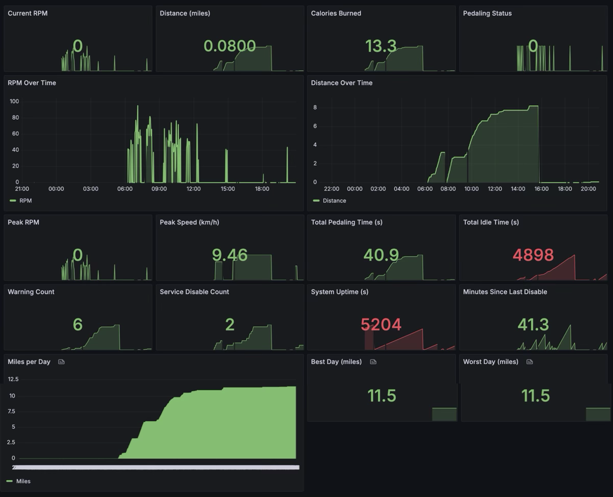

# BikeOS - Smart Bike Monitoring System

## Why?

When I'm working, I sometimes forget to pedal. This tool simply takes metrics from the bike and creates prom metrics as well as a warning system to remind myself to pedal.

## Features

- Real-time RPM monitoring
- Distance tracking
- Calorie estimation
- Prometheus metrics endpoint
- Warning system with configurable patterns
- Service control via HTTP endpoint
- Automatic dependency management
- Comprehensive system metrics
- Logging system with rotation
- Peak metrics tracking and auto-reset
- Multiple HTTP endpoints for metrics, service control, and logs

## Hardware Requirements

### Main Components
- Raspberry Pi Zero 2 W (Wireless / Bluetooth) 2021
- MakerHawk 2pcs Speaker 3 Watt 8 Ohm
- JST connectors for Y-cable
- Hall effect sensor (built into bike)
- Power supply for Raspberry Pi

### Wiring Diagram

```
Raspberry Pi Zero 2 W
+------------------+
|                  |
|  GPIO17  ───────┼─── Hall Sensor Signal
|                  |
|  GPIO18  ───────┼─── Buzzer/Speaker (+)
|                  |
|  GND     ───────┼─── Buzzer/Speaker (-)
|                  |
|  GND     ───────┼─── Hall Sensor GND
|                  |
+------------------+

Hall Sensor Y-Cable
+------------------+
|                  |
|  Signal  ───────┼─── Original Bike Computer
|                  |
|  Signal  ───────┼─── Raspberry Pi GPIO17
|                  |
|  GND     ───────┼─── Raspberry Pi GND
|                  |
+------------------+
```

## Software Requirements

- Python 3.x
- RPi.GPIO library
- HTTP server capabilities

## Installation

1. Clone the repository:
```bash
git clone https://github.com/yourusername/bikeos.git
cd bikeos
```

2. The system will automatically install required dependencies on first run.

3. Install as a systemd service:
```bash
# Make the script executable
chmod +x install.sh

# Run the installation script
sudo ./install.sh
```

The installation script will:
- Detect Python path
- Create systemd service
- Enable and start the service
- Verify the installation

4. View service logs:
```bash
# View logs using journalctl
sudo journalctl -u bikeos -f
```

## Usage

1. Start the system:
```bash
python main.py
```

2. Access metrics:
```bash
curl http://localhost:8000/metrics
```

3. Control service:
```bash
curl http://localhost:5000/service
```

## Metrics

The system provides the following Prometheus metrics:

### Core Metrics
- `bike_distance`: Total distance in meters
- `bike_rpm`: Current RPM
- `bike_pedaling`: Whether currently pedaling
- `bike_calories`: Estimated calories burned (1 calorie per 10 meters)

### System Metrics
- `bike_system_uptime`: System uptime in seconds
- `bike_total_pedaling_time`: Total pedaling time
- `bike_total_idle_time`: Total idle time
- `bike_total_warning_time`: Total warning time
- `bike_warning_count`: Number of warnings
- `bike_service_disable_count`: Service disable events
- `bike_peak_rpm`: Highest recorded RPM (resets every 5 minutes)
- `bike_peak_speed`: Highest recorded speed in km/h (resets every 5 minutes)
- `bike_total_pulses`: Total hall sensor pulses
- `bike_error_count`: System errors
- `bike_metrics_update_interval`: Current update frequency

## Warning System

The system provides audio warnings when:
1. Pedaling stops (long beep)
2. Pedaling starts (short beep)
3. Service is disabled
4. System errors occur

Warning patterns:
- Short beep (100ms): Pedaling start
- Long beep (500ms): Pedaling stop
- Multiple beeps: Warning pattern when stopped

## Service Control

The system can be controlled via HTTP endpoints:
- GET `/service`: Disable the service
- Service automatically re-enables when pedaling starts

## Performance

- Active state: Metrics update every 1 second
- Disabled state: Metrics update every 5 seconds
- Automatic resource optimization
- Log rotation (10MB file size limit)
- Thread-safe operations
- Peak metrics auto-reset every 5 minutes


## Grafana Dashboard



## Contributing

Feel free to submit issues and enhancement requests!

## License

GPL3